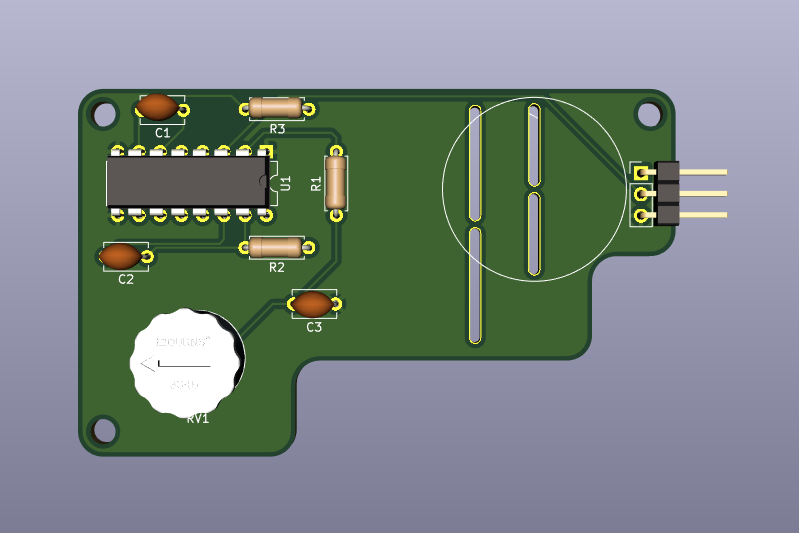
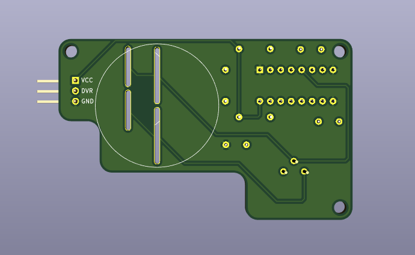
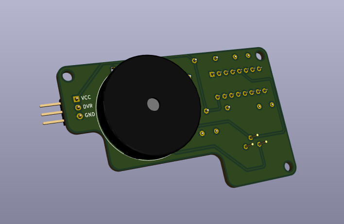
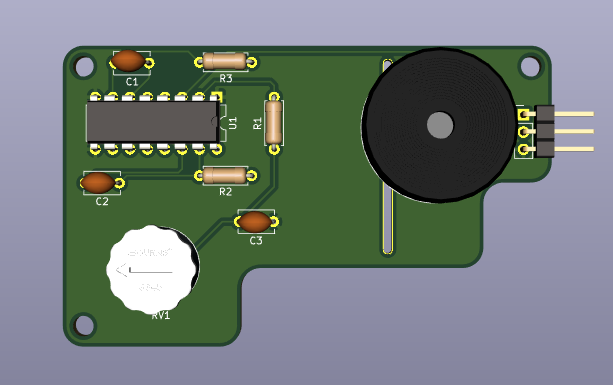

# 4704_buzzer
A recreation of the IBM 4704 Series buzzer board

This board has been reverse engineered from a buzzer board found in a genuine IBM 4704 Series Model F 107 keyboard.

# PCB design notes
Due to the physical constraints of the space available inside the IBM 4704 Series Model F keyboard cases for housing the buzzer board, only 7.5mm of height is available to house a physical buzzer mounted on the top of the PCB.
However, due to the availability and different shapes and dimensions (and the cost) of the buzzers available in the market, it's not easy (and cheap) to find one that would satisfy these constraints.
So I decided to add a second footprint on the bottom of the PCB that would allow to take advantage of the space available underneath the board to house a bigger buzzer.

The maximum dimensions of the buzzers that would be compatible with this board are:
- BZ1 (Buzzer installed on the bottom of the PCB): L=30mm, W=30mm, H=16.5mm

- BZ2 (Buzzer installed on the top of the PCB): L=22mm, W=22mm, H=7mm

These dimensions work for 1.6mm thick PCB boards.
While I don't recommend this, you could choose a less thick PCB when ordering the board from your PCB Fabrication Manufacturer.
This would let you choose a bigger (height wise) buzzer to mount on the top or bottom of the PCB, however, beware that the PCB might not be able to sit correctly inside the case.

# Ordering from JLCPCB
1) Go to http://jlcpcb.com , sign in to your account (create one if you don't have one)
2) Click Order Now
3) Upload the .zip file from the "production" subfolder
4) Select PCB Qty you wish to build
5) Set "Remove Order Number" to "Specify a location"

# BOM
- C1: 20nF
- C2: 20nF
- C3: 7nF
- R1: 330
- R2: 27K
- R3: 27K
- RV1: 20K (I recommend Bourns 3345P-1-203-T)

# License
You can redistribute this project and/or modify it under the terms of the
GNU General Public License as published by the Free Software Foundation,
either version 3 of the License, or (at your option) any later version.

This program is distributed in the hope that it will be useful,
but WITHOUT ANY WARRANTY; without even the implied warranty of
MERCHANTABILITY or FITNESS FOR A PARTICULAR PURPOSE.  See the
GNU General Public License for more details.

You should have received a copy of the GNU General Public License
along with this program.  If not, see <http://www.gnu.org/licenses/>.

